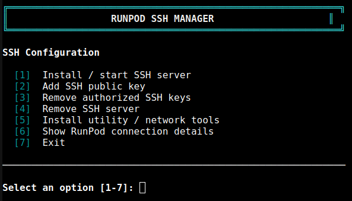
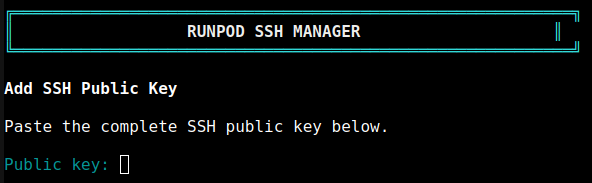
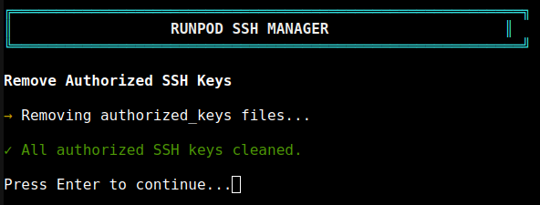
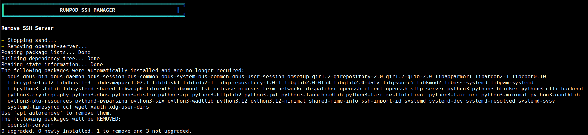
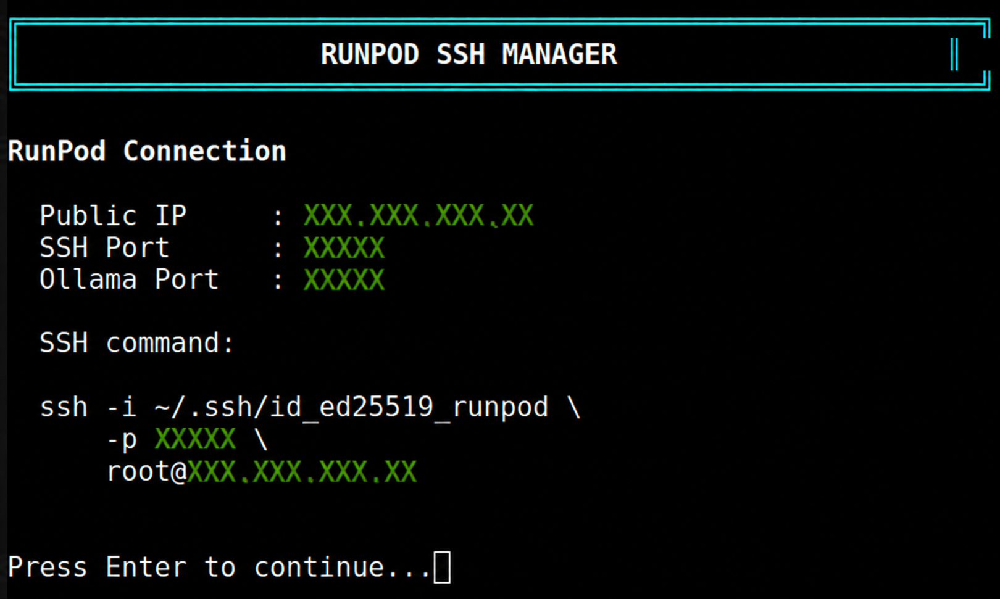

# Runpod_Init_Manager_2026
Scripts to automate initial Runpod essentials post-Pod initialization

## RunPod SSH Manager:
A lightweight interactive Bash utility for managing SSH access on RunPod containers.
The manager handles SSH server installation, SSH key management, cleanup, utility installation, and displays the current RunPod connection information.

### Features

- Install and start `openssh-server`
- Add an SSH public key for `root`
- Remove authorized SSH keys
- Remove the SSH server
- Install common utility and network tools
- Install `nano`
- Install `nmap`
- Install `ping`
- Install OpenSSH client tools (`ssh`, `scp`, `sftp`)
- Display the current RunPod public IP and SSH port
- Display a ready-to-use SSH command
- Uses RunPod's dynamically assigned `PUBLIC_IP` and SSH port

---

### Usage

#### CURL down the script on your Pod:
```bash
curl -fsSL https://raw.githubusercontent.com/nithyanandhm/Runpod_Init_Manager_2026/refs/heads/main/runpod_init_manager.sh > PodSetup.sh
```

#### Make the script executable:
```bash
chmod +x PodSetup.sh
```

#### Run your Manager:
```bash
./PodSetup.sh
```


---

### Manager Options

#### Install / Start SSH Server

Installs `openssh-server` if it is not already installed and starts `sshd`.

```text
[1] Install / start SSH server
```

The script also creates `/run/sshd` when required.


---

#### Add SSH Public Key

Adds an SSH public key to:

```text
/root/.ssh/authorized_keys
```

```text
[2] Add SSH public key
```

The script checks whether the key already exists before adding it.



---

#### Remove Authorized SSH Keys

Removes authorized SSH keys from the root account and user home directories.

```text
[3] Remove authorized SSH keys
```



---

#### Remove SSH Server

Stops `sshd` and removes the `openssh-server` package.

```text
[4] Remove SSH server
```



---

#### Install Utility / Network Tools

Installs common tools useful for managing and troubleshooting the RunPod container.

```text
[5] Install utility / network tools
```

The following packages are installed:

- `nano` — command-line text editor
- `nmap` — network discovery and port scanning
- `iputils-ping` — `ping` network connectivity utility
- `openssh-client` — provides:
  - `ssh`
  - `scp`
  - `sftp`

The manager also verifies that the installed commands are available after installation.


---

#### Show RunPod Connection Details:

Displays the **current RunPod connection information**.

```text
[6] Show RunPod connection details
```

Example:

```text
RunPod Connection

  Public IP     : xxx.xxx.xxx.xx
  SSH Port      : xxxxx
  Ollama Port   : xxxxx

  SSH command:

  ssh -i ~/.ssh/id_ed25519_runpod \
      -p xxxxx \
      root@xxx.xxx.xxx.xx
```

The Public IP and SSH port are read directly from the current RunPod environment:

```text
RUNPOD_PUBLIC_IP
RUNPOD_TCP_PORT_22
```

This means the displayed connection information automatically reflects the Pod's currently assigned IP address and SSH port.



---

#### Exit:

```text
[7] Exit
```

---

### Requirements:

- RunPod Linux container
- Root access
- `apt` package manager
- RunPod environment variables:
  - `RUNPOD_PUBLIC_IP`
  - `RUNPOD_TCP_PORT_22`

---

### Notes:

RunPod may assign different connection values when a Pod is recreated or moved.

The manager reads the current values directly from the RunPod environment whenever connection details are displayed.

The SSH private key remains on the client machine. Only the corresponding public key is added to the RunPod container.

The OpenSSH client tools installed through the utility option allow files to be transferred between the local machine and RunPod using `scp` or `sftp`.

---

### Repository Structure

```text
Runpod_Init_Manager_2026/
├── runpod_init_manager.sh
├── README.md
└── screenshots/
    ├── main-menu.png
    ├── install-sshd.png
    ├── add-keys.png
    ├── remove-keys.png
    ├── remove-sshd.png
    ├── install-utilities.png
    └── connection-details.png
```
